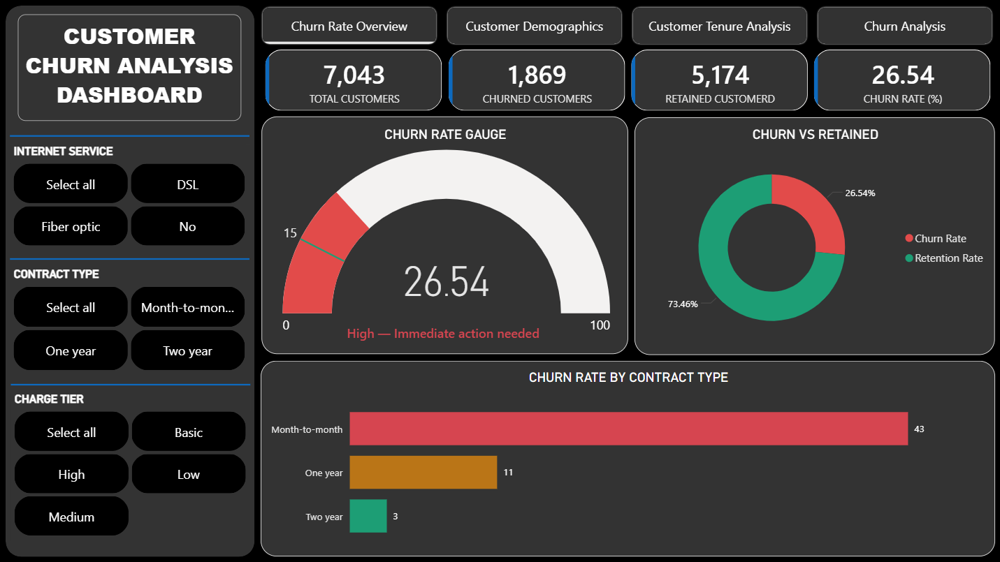
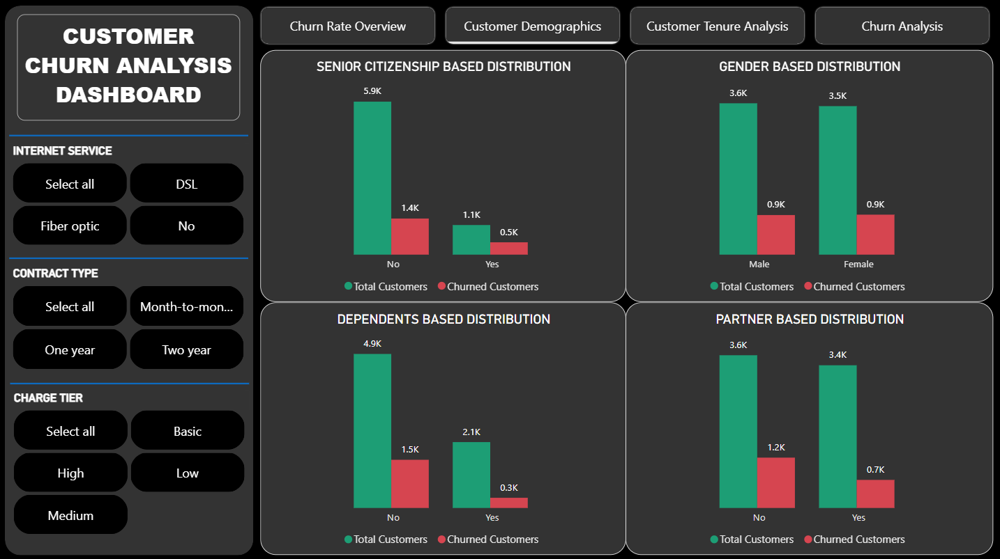
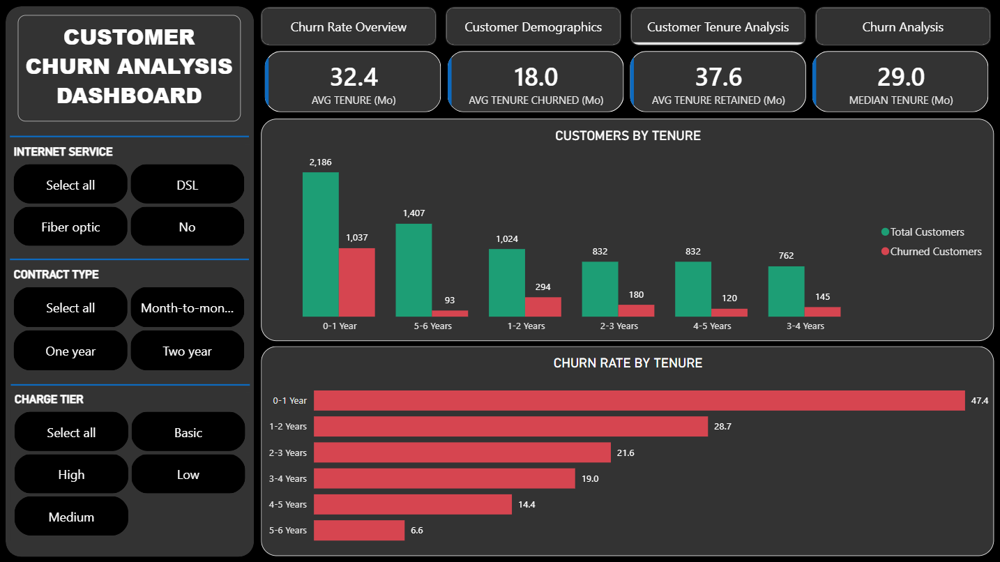
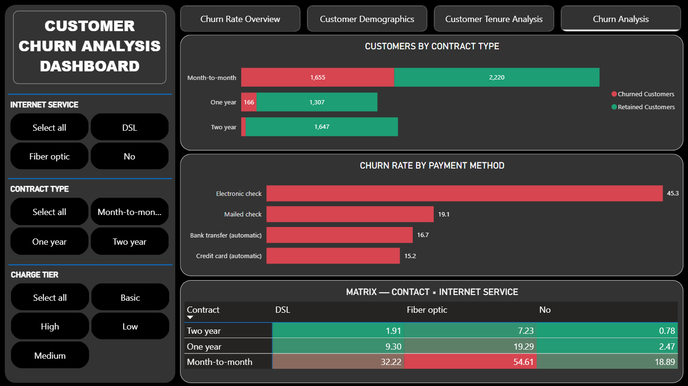

# 📡 Telecom Customer Churn Analysis

<div align="center">


**A comprehensive end-to-end Data Analytics project built with Microsoft Power BI to identify, analyze, and visualize the key drivers of customer churn in the telecom industry — transforming raw data into actionable business intelligence.**

[📊 View Dashboard Screenshots](#-dashboard-preview) · [📁 Explore Dataset](#-dataset-overview) · [📄 Read Analysis Report](#-analysis-report)

</div>

---

## 📌 Table of Contents

- [Overview](#-overview)
- [Business Problem](#-business-problem)
- [Objectives](#-objectives)
- [Tech Stack](#-tech-stack)
- [Project Structure](#-project-structure)
- [Dataset Overview](#-dataset-overview)
- [Dashboard Preview](#-dashboard-preview)
- [Key Insights](#-key-insights)
- [DAX Measures & KPIs](#-dax-measures--kpis)
- [Data Modelling](#-data-modelling)
- [How to Use](#-how-to-use)
- [Analysis Report](#-analysis-report)
- [License](#-license)
- [Author](#-author)

---

## 🔍 Overview

Customer churn is one of the most critical challenges in the telecom industry. Acquiring a new customer costs significantly more than retaining an existing one, making churn prediction and analysis essential for long-term business growth.

This project leverages **Microsoft Power BI** to perform a full-scale exploratory and analytical deep-dive into a telecom company's customer base — uncovering patterns, trends, and risk factors that drive customers to leave. The result is a suite of interactive dashboards that allow business stakeholders to make data-driven decisions with clarity and confidence.

---

## 💼 Business Problem

> *"Why are customers leaving — and what can we do about it?"*

A telecom provider is experiencing a significant customer attrition rate. The leadership team needs a clear picture of:

- **Who** is churning (demographic and behavioral profiles)
- **Why** they are churning (service, contract, billing issues)
- **When** churn risk peaks (tenure, contract type)
- **Where** to focus retention efforts (high-risk segments)

---

## 🎯 Objectives

- Clean and model raw telecom customer data for analytical use
- Build interactive, multi-page Power BI dashboards
- Define and calculate meaningful KPIs using DAX formulas
- Identify high-risk customer segments and churn drivers
- Deliver actionable recommendations to reduce churn

---

## 🛠 Tech Stack

| Tool / Technology | Purpose |
|---|---|
| **Microsoft Power BI Desktop** | Dashboard development & data visualization |
| **DAX (Data Analysis Expressions)** | Custom KPIs, calculated columns & measures |
| **Power Query (M Language)** | Data transformation and cleaning |
| **CSV (Telco Dataset)** | Source data |
| **PDF** | Analysis report export |

---

## 📁 Project Structure

```
Telecom-Customer-Churn-Analysis/
│
├── Customer_Churn_Analysis.pbix       # Main Power BI report file
├── Telco_Customer_Churn_Dataset.csv   # Source dataset
├── Analysis_Report.pdf                # Detailed analysis report
│
├── Churn_Page_1.png                   # Dashboard screenshot – Overview
├── Churn_Page_2.png                   # Dashboard screenshot – Demographics
├── Churn_Page_3.png                   # Dashboard screenshot – Services
├── Churn_Page_4.png                   # Dashboard screenshot – Risk Analysis
│
├── LICENSE                            # MIT License
└── README.md                          # Project documentation
```

---

## 📊 Dataset Overview

The dataset used is the well-known **Telco Customer Churn Dataset**, containing records of ~7,000 telecom customers with the following key attributes:

| Category | Features |
|---|---|
| **Demographics** | Gender, Senior Citizen, Partner, Dependents |
| **Account Info** | Customer ID, Tenure, Contract Type, Paperless Billing, Payment Method |
| **Services** | Phone, Multiple Lines, Internet, Online Security, Streaming TV/Movies |
| **Financials** | Monthly Charges, Total Charges |
| **Target** | Churn (Yes / No) |

> 📥 Dataset file: `Telco_Customer_Churn_Dataset.csv`

---

## 🖥 Dashboard Preview

The Power BI report consists of **4 interactive pages**, each targeting a specific analytical lens:

### Page 1 — Churn Overview
High-level KPIs including total customers, churn rate, retained customers, and revenue at risk.



---

### Page 2 — Customer Demographics
Churn breakdown by gender, age group, senior citizen status, and family structure.



---

### Page 3 — Services & Subscriptions
Analysis of churn rates across different service types — internet, streaming, security, and more.



---

### Page 4 — Risk & Revenue Analysis
Churn segmentation by contract type, tenure buckets, payment method, and monthly charges.



---

## 💡 Key Insights

- 📉 **Overall churn rate** stands at approximately **26.5%**, representing a significant revenue loss risk.
- 📋 **Month-to-month contract** customers churn at a drastically higher rate compared to those on 1- or 2-year contracts.
- 💳 Customers paying via **electronic check** show the highest churn tendency among all payment methods.
- 👴 **Senior citizens** represent a disproportionately higher churn segment relative to their share of the customer base.
- 🌐 Customers subscribed to **Fiber Optic internet** churn more than DSL users — likely indicating service dissatisfaction.
- ⏳ The **first 12 months** of tenure are the most critical — early-stage customers are the highest churn risk group.
- 🔒 Customers enrolled in **Online Security** and **Tech Support** services show notably lower churn rates.
- 💰 Higher **monthly charges** correlate strongly with increased churn probability.

---

## 📐 DAX Measures & KPIs

Key DAX measures built in this project include:

```dax
-- Total Customers
Total Customers = COUNTROWS('TelcoCustomerData')

-- Churned Customers
Churned Customers = CALCULATE(COUNTROWS('TelcoCustomerData'), 'TelcoCustomerData'[Churn] = "Yes")

-- Churn Rate
Churn Rate % = DIVIDE([Churned_Customers], [Total_Customers],0) * 100

-- Retained Customers
Retained Customers = [Total Customers] - [Churned Customers]

-- Monthly Revenue at Risk
Revenue at Risk = CALCULATE(SUM('TelcoCustomerData'[MonthlyCharges]), 'TelcoCustomerData'[Churn] = "Yes")

-- Average Tenure (Churned)
Avg Tenure Churned = CALCULATE(AVERAGE('TelcoCustomerData'[Tenure]), 'TelcoCustomerData'[Churn] = "Yes")
```

---

## 🗂 Data Modelling

The data model was designed using **Power Query** for transformation and **Power BI's model view** for relationships:

- Null values and blank records in `TotalCharges` were handled during data cleaning
- Data types were standardized (text, numeric, boolean)
- Calculated columns created for **Tenure Buckets**, **Charge Categories**, and **Risk Tiers**
- Single-table star schema used for this project with derived dimension columns

---

## ▶ How to Use

1. **Clone this repository**
   ```bash
   git clone https://github.com/insights-by-sandip/Telecom-Customer-Churn-Analysis.git
   ```

2. **Open the Power BI file**
   - Install [Microsoft Power BI Desktop](https://powerbi.microsoft.com/desktop/) (free)
   - Open `Customer_Churn_Analysis.pbix`

3. **Explore the dashboard**
   - Navigate across all 4 pages using the report tabs
   - Use slicers and filters to drill down into specific segments

4. **Review the dataset**
   - Open `Telco_Customer_Churn_Dataset.csv` to explore the raw data

5. **Read the full analysis**
   - Open `Analysis_Report.pdf` for a detailed written walkthrough

---

## 📄 Analysis Report

A comprehensive written analysis is available as a PDF report in the repository.

> 📎 [`Analysis_Report.pdf`](./Analysis_Report.pdf)

The report covers the full analytical narrative — from data preparation and modelling to final business recommendations.

---

## 📜 License

This project is licensed under the **MIT License** — you are free to use, modify, and distribute this work with attribution.

See the [`LICENSE`](./LICENSE) file for full details.

---

## 👤 Author

**Sandip** · Data Analytics Enthusiast

[](https://github.com/insights-by-sandip)

---

<div align="center">

⭐ **If you found this project helpful, please consider giving it a star!** ⭐

*Built with 💙 using Microsoft Power BI*

</div>
